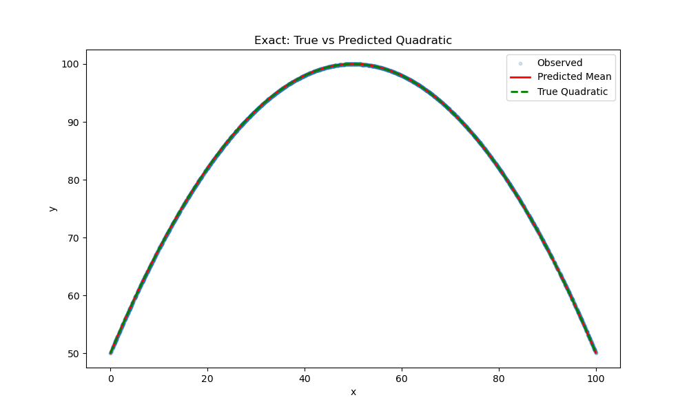

# Guidebook: Bayesian Inference with PyMC for Quadratic Modeling

This guidebook provides a comprehensive resource for applying **Bayesian inference** using PyMC to model quadratic relationships, based on the `pymc_explore.py` script and its results. It covers the fundamentals of Bayesian inference, the experiment's design, scaling considerations, model building, metrics interpretation, visualization analysis, general strategies for applying this process to other problems, how to assess confidence in predictions, troubleshooting, and tips for improving your skills in Bayesian inference. The guide assumes familiarity with Python and basic statistics but explains concepts in an accessible way for intermediate practitioners, including a foundational overview for those new to Bayesian methods. It uses the provided results to illustrate key points and includes examples to guide future applications. Plots generated by the script are included as images, assuming this Markdown file is placed in the root folder alongside the `pymc_exploration` directory.

---

## Chapter 1: Fundamentals of Bayesian Inference

To effectively apply **Bayesian inference**, it's essential to understand its core principles. This chapter provides a foundational overview, addressing common gaps in knowledge for practitioners transitioning from frequentist statistics or those new to probabilistic programming. Bayesian inference treats parameters as random variables with probability distributions, allowing us to update beliefs based on data.

### 1.1 Bayes' Theorem: The Core of Bayesian Inference

**Bayesian inference** is built on Bayes' theorem, which describes how to update the probability of a hypothesis (parameters) given new evidence (data):

$$ P(\theta | D) = \frac{P(D | \theta) \cdot P(\theta)}{P(D)} $$

- **Posterior $P(\theta | D)$**: The updated belief about the parameters $\theta$ after observing data $D$.
- **Likelihood $P(D | \theta)$**: The probability of observing the data given the parameters, modeling how data is generated.
- **Prior $P(\theta)$**: Initial beliefs about the parameters before seeing the data, based on domain knowledge or weak assumptions.
- **Marginal Likelihood $P(D)$**: The normalizing constant, often computed as $\int P(D | \theta) P(\theta) d\theta$, which ensures the posterior integrates to 1. In practice, it's rarely computed directly in MCMC methods.

This framework handles **missing information** by incorporating uncertainty through priors and posteriors, making Bayesian methods robust to incomplete data or noisy observations.

### 1.2 Key Components in Practice

1. **Priors**: Represent prior knowledge. Informative priors (e.g., based on previous studies) can guide the model; weak priors (e.g., broad normals) let data dominate. Poor prior choice can bias results—sensitivity analysis (varying priors) helps check robustness.
2. **Likelihood**: Models the data-generating process (e.g., Normal for continuous data with noise).
3. **Posterior**: The goal—distribution of parameters given data. For complex models, analytical solutions are rare, so we use sampling methods.
4. **Inference via MCMC**: Markov Chain Monte Carlo (MCMC) approximates the posterior by drawing samples. PyMC uses **No-Utter-Turn Sampler (NUTS)**, an efficient Hamiltonian Monte Carlo variant that adapts to the posterior geometry, reducing correlations in samples.

### 1.3 Advantages Over Frequentist Methods

- **Uncertainty Quantification**: Provides full distributions, not just point estimates and confidence intervals.
- **Incorporating Prior Knowledge**: Useful for small datasets or domain expertise.
- **Flexibility**: Handles hierarchical models, missing data (via imputation in the model), and complex relationships.
- **Prediction**: Posterior predictive distributions naturally account for uncertainty.

### 1.4 Common Challenges and How to Overcome Them

- **Computational Intensity**: MCMC can be slow; start with simple models and use efficient samplers like NUTS.
- **Convergence Issues**: Monitor diagnostics (R-hat, ESS); divergences indicate model problems.
- **Prior Elicitation**: When lacking knowledge, use weakly informative priors (e.g., $Normal(0, 10)$) or empirical Bayes (estimate from data).
- **Model Misspecification**: Use posterior predictive checks (PPC) to compare simulated data to observed.

To build intuition, start with simple problems like coin flips: Prior $Beta(1,1)$ (uniform), likelihood Binomial, posterior $Beta(1+\text{heads}, 1+\text{tails})$.

This foundation will help you interpret the quadratic modeling experiment and apply **Bayesian methods** confidently.

---

## Chapter 2: Introduction to the Experiment

The `pymc_explore.py` script conducts a **Bayesian inference experiment** to model a quadratic function $y = -0.02x^2 + 2x + 50$ across four datasets with varying levels of noise and randomness. The datasets, each with 4,096 samples, are:

1. **Exact Dataset**: Generated directly from the quadratic function with no noise.
2. **Noisy Dataset**: The quadratic function with Gaussian noise ($\sigma = 10$).
3. **Random Dataset**: Random y-values uniformly sampled between 0 and 200, ignoring the quadratic function.
4. **Half_Half Dataset**: A 50-50 mix of noisy and random y-values.

The script uses PyMC to fit a Bayesian model, estimating parameters ($a$, $b$, $c$, $\sigma$) and evaluating performance with metrics (MAE, RMSE, R-squared, LOO) and visualizations (prior, posterior, trace, posterior predictive, and true vs. predicted plots). The results provided show the script's output, including dataset summaries, sampling diagnostics, parameter estimates, metrics, and convergence diagnostics.

This guidebook explains:

- **Fundamentals**: Core Bayesian concepts for a strong theoretical base.
- **Scaling**: Why and how x-values are scaled, and how to ensure correct model specification.
- **Model Building**: Steps to build a robust Bayesian model, including prior selection and numerical stability.
- **Metrics**: Definitions, interpretations, and expected values for perfect and poor models.
- **Plots**: Descriptions of each plot, their significance, and differences between Exact and Random datasets, with images included.
- **Generalization**: Strategies for applying this process to other problems, with examples of data scaling.
- **Confidence in Predictions**: How to quantify confidence using the posterior predictive distribution and credible intervals.
- **Improving Skills**: Tips and resources for mastering Bayesian inference.

---

## Chapter 3: Understanding Scaling in Bayesian Modeling

### 3.1 Why Scaling is Necessary

**Scaling** is critical in Bayesian modeling to ensure numerical stability, especially when dealing with large input values or complex models. In the script, x-values range from 0 to 100, so $x^2$ ranges from 0 to 10,000. Without scaling, the quadratic term $a \cdot x^2$ can produce large values, leading to numerical overflows in the **Hamiltonian Monte Carlo (HMC)** sampling used by PyMC's NUTS algorithm. The provided results for the Random and Half_Half datasets show overflow warnings, indicating that even with scaling, numerical issues can persist if not carefully managed.

The script scales x-values by dividing by 100 ($x_{\text{scaled}} = x / 100$), so $x_{\text{scaled}}$ ranges from 0 to 1, and $x_{\text{scaled}}^2$ from 0 to 1. This reduces the magnitude of the quadratic term, stabilizing sampling.

### 3.2 Scaling in the Model

The true quadratic function is:

$$ y = -0.02x^2 + 2x + 50 $$

With scaling ($x_{\text{scaled}} = x / 100$), the function becomes:

$$ y = -0.02 \cdot (100^2 \cdot x_{\text{scaled}}^2) + 2 \cdot (100 \cdot x_{\text{scaled}}) + 50 = -200 \cdot x_{\text{scaled}}^2 + 200 \cdot x_{\text{scaled}} + 50 $$

Thus, the model is:

$$ \mu = a \cdot x_{\text{scaled}}^2 + b \cdot x_{\text{scaled}} + c $$

With scaled parameters:

- $a = -200$
- $b = 200$
- $c = 50$

The priors are set around these values:

- $a \sim \text{Normal}(-200, 20)$
- $b \sim \text{Normal}(200, 20)$
- $c \sim \text{Normal}(50, 10)$
- $\sigma \sim \text{HalfNormal}(20)$

### 3.3 Ensuring Correct Scaling

To build the model correctly:

1. **Scale Inputs**: Normalize input features to a small range (e.g., 0 to 1 or -1 to 1). In this case, dividing x by 100 was sufficient, but other methods like min-max scaling or standardization may be needed.
2. **Adjust Priors**: Ensure priors reflect the scaled parameters. For example, the quadratic coefficient $a$ is -200 in the scaled model, not -0.02.
3. **Consistent Predictions**: Compute predictions using scaled inputs ($y_{\text{pred}} = a \cdot x_{\text{scaled}}^2 + b \cdot x_{\text{scaled}} + c$) and compare them to unscaled y-values, as the output scale remains unchanged.
4. **Validate Scaling**: Plot predictions against the true function using original x-values to ensure alignment (as done in the true vs. predicted plot).

### 3.4 Other Scaling Examples

- **Standardization**: For a feature with mean $\mu$ and standard deviation $\sigma$, scale as $x_{\text{scaled}} = (x - \mu) / \sigma$. This is useful for normally distributed data or when comparing features with different units.
- **Log Transformation**: For exponentially distributed data (e.g., prices or counts), apply $x_{\text{scaled}} = \log(x + 1)$ to compress the range.
- **Feature-Specific Scaling**: In multivariate models, scale each feature independently to ensure comparable magnitudes. For example, in a model with x (0 to 100) and z (0 to 1,000), scale x by 100 and z by 1,000.

**Example**: In a linear regression model $y = \beta_1 x_1 + \beta_2 x_2$, if $x_1$ is income (0 to 100,000) and $x_2$ is age (0 to 100), scale $x_1$ by 100,000 and $x_2$ by 100 to normalize their contributions, adjusting $\beta_1$ and $\beta_2$ priors accordingly.

---

## Chapter 4: Building a Robust Bayesian Model

### 4.1 Model Components

The **Bayesian model** in the script consists of:

1. **Priors**: Distributions over parameters ($a$, $b$, $c$, $\sigma$) reflecting prior beliefs. Broad priors (e.g., $\sigma_a = 20$) allow flexibility, while centered priors (e.g., $a \sim \text{Normal}(-200, 20)$ ) incorporate knowledge of the true function. To improve prior selection when domain knowledge is missing, use weakly informative priors (e.g., $Normal(0, 100)$) or hierarchical priors for data-driven shrinkage.
2. **Likelihood**: A Normal distribution $y \sim \text{Normal}(\mu, \sigma)$, where $\mu = a \cdot x_{\text{scaled}}^2 + b \cdot x_{\text{scaled}} + c$, models the observed data.
3. **Posterior**: Computed via NUTS sampling, combining priors and likelihood to estimate parameter distributions.

### 4.2 Steps to Build the Model

1. **Define the Functional Form**:
   - Identify the relationship (e.g., quadratic: $y = a x^2 + b x + c$).
   - Scale inputs if necessary to ensure numerical stability.

2. **Choose Priors**:
   - Use domain knowledge to center priors (e.g., $a = -200$ for the scaled quadratic).
   - Select broad priors for flexibility, especially for noisy or unstructured data (e.g., $\sigma = 20$ for Random dataset).
   - Use HalfNormal for standard deviations to ensure positivity.
   - For **missing information**: If unsure, perform prior predictive checks—simulate data from priors to ensure realism.

3. **Specify the Likelihood**:
   - Choose a distribution matching the data (Normal for continuous data with Gaussian noise).
   - Ensure the mean ($\mu$) incorporates scaled inputs.

4. **Sample the Posterior**:
   - Use NUTS with multiple chains (e.g., 4 chains, 1,000 draws each) for robust sampling.
   - Monitor convergence with R-hat (< 1.01) and ESS (> 100). If issues arise, increase `target_accept` or tune steps.

5. **Validate the Model**:
   - Check parameter estimates against true values.
   - Use posterior predictive checks to assess fit.
   - Plot true vs. predicted values to visualize alignment.
   - Add model comparison: Use LOO for multiple models (e.g., compare quadratic vs. linear).

### 4.3 Common Pitfalls and Solutions

- **Numerical Instability**: Large input values or extreme parameters can cause overflows (as seen in Random and Half_Half datasets). Solution: Scale inputs and tighten priors if necessary.
- **Divergences**: The Exact dataset showed 1,544 divergences, indicating sampling issues. Solution: Increase `target_accept` (e.g., to 0.995) or reparameterize (e.g., center x-values).
- **Poor Convergence**: High R-hat (3.4279 for Exact) and low ESS (4 for Exact) suggest sampling problems. Solution: Simplify the model, increase tuning steps, or check for model misspecification.
- **Overfitting/Underfitting**: Use PPC and LOO to detect; consider hierarchical models for more flexibility.

---

## Chapter 5: Metrics and Their Interpretation

The script computes four metrics to evaluate model performance: **Mean Absolute Error (MAE)**, **Root Mean Squared Error (RMSE)**, **R-squared**, and **Leave-One-Out Cross-Validation (LOO)**. Below, each metric is defined, interpreted, and illustrated with expected values for perfect and poor models. To better assess Bayesian models, consider adding **WAIC (Widely Applicable Information Criterion)** for model comparison when LOO is unstable.

### 5.1 Mean Absolute Error (MAE)

**Definition**: The average absolute difference between observed ($y$) and predicted ($y_{\text{pred}}$) values:

$$ \text{MAE} = \frac{1}{n} \sum_{i=1}^n |y_i - y_{\text{pred},i}| $$

**Interpretation**: Measures average prediction error in the same units as y. Lower values indicate better fit.

- **Perfect Model**: MAE $\approx 0$, as predictions match observations exactly.
  - **Example (Exact Dataset)**: MAE = 2.298e-11 $\approx 0$, indicating a perfect fit, as the model recovers the true quadratic.
- **Poor Model**: High MAE, reflecting large prediction errors.
  - **Example (Random Dataset)**: MAE = 25.1148, indicating poor fit, as random y-values are unrelated to x.

### 5.2 Root Mean Squared Error (RMSE)

**Definition**: The square root of the average squared differences between observed and predicted values:

$$ \text{RMSE} = \sqrt{\frac{1}{n} \sum_{i=1}^n (y_i - y_{\text{pred},i})^2} $$

**Interpretation**: Penalizes larger errors more than MAE, also in y-units. Lower values are better.

- **Perfect Model**: RMSE $\approx 0$.
  - **Example (Exact Dataset)**: RMSE = 3.064e-11 $\approx 0$, confirming perfect fit.
- **Poor Model**: High RMSE, especially with large outliers.
  - **Example (Random Dataset)**: RMSE = 29.0090, reflecting significant errors due to randomness.

### 5.3 R-squared

**Definition**: The proportion of variance in y explained by the model:

$$ R^2 = 1 - \frac{\sum (y_i - y_{\text{pred},i})^2}{\sum (y_i - \bar{y})^2} $$

**Interpretation**: Ranges from 0 to 1 (or negative if worse than a mean-only model). Higher values indicate better fit.

- **Perfect Model**: $R^2 = 1$, explaining all variance.
  - **Example (Exact Dataset)**: $R^2 = 1.0000$, as the model perfectly captures the quadratic.
- **Poor Model**: $R^2 \approx 0$ or negative, indicating no explanatory power.
  - **Example (Random Dataset)**: $R^2 = -0.0054$, worse than a mean-only model due to random y-values.

### 5.4 Leave-One-Out Cross-Validation (LOO)

**Definition**: An estimate of the expected log predictive density, computed via Pareto-smoothed importance sampling:

$$ \text{LOO} = \sum_{i=1}^n \log p(y_i | y_{-i}) $$

**Interpretation**: Higher (less negative) values indicate better out-of-sample predictive performance. In PyMC, LOO is reported as the expected log pointwise predictive density (elpd_loo).

- **Perfect Model**: Very high LOO, as predictions are accurate.
  - **Example (Exact Dataset)**: LOO = 71180.2136, exceptionally high due to perfect fit (though convergence issues suggest caution).
- **Poor Model**: Low or negative LOO, reflecting poor predictive ability.
  - **Example (Random Dataset)**: LOO = -19609.1656, indicating poor performance due to random data.

### 5.5 Results Summary

| Dataset   | MAE       | RMSE      | R-squared | LOO         |
|-----------|-----------|-----------|-----------|-------------|
| Exact     | 2.298e-11 | 3.064e-11 | 1.0000    | 71180.2136  |
| Noisy     | 8.0884    | 10.1626   | 0.6790    | -15313.3793 |
| Random    | 25.1148   | 29.0090   | -0.0054   | -19609.1656 |
| Half_Half | 23.0104   | 28.2051   | 0.0692    | -19494.2031 |

- **Exact**: Perfect metrics (MAE, RMSE $\approx 0$, $R^2 = 1$), but high R-hat and low ESS indicate sampling issues, likely due to zero noise ($\sigma \approx 0$).
- **Noisy**: Reasonable MAE and RMSE (~10, matching noise $\sigma = 10$), good $R^2 = 0.6790$, and moderate LOO, reflecting a good but not perfect fit.
- **Random**: High MAE and RMSE, negative $R^2$, and poor LOO, as expected for unstructured data.
- **Half_Half**: Slightly better than Random due to partial structure, but still poor metrics.

---

## Chapter 6: Visualizations and Their Significance

The script generates five plots per dataset, saved in the `pymc_exploration` directory. These plots are included below with relative paths for viewing when this Markdown file is placed in the root folder.

1. **Prior Distributions** (`pymc_exploration/<dataset>_prior.png`): Shows prior distributions for $a$, $b$, $c$, and $\sigma$.
2. **Posterior Distributions** (`pymc_exploration/<dataset>_posterior.png`): Displays posterior distributions with 94% highest density intervals (HDIs).
3. **Trace Plots** (`pymc_exploration/<dataset>_trace.png`): Shows sampling chains and posterior density for convergence diagnostics.
4. **Posterior Predictive Check** (`pymc_exploration/<dataset>_ppc.png`): Plots observed data, predicted mean, and 95% credible interval.
5. **True vs. Predicted Quadratic** (`pymc_exploration/<dataset>_true_vs_pred.png`): Compares predicted mean to the true quadratic (for Exact and Noisy).

### 6.1 Prior Distributions

**Description**: Density plots of the prior distributions for $a$, $b$, $c$, and $\sigma$.

**Significance**: Shows the model's initial beliefs before observing data. In this case:

- $a \sim \text{Normal}(-200, 20)$: Centered at -200, with moderate spread.
- $b \sim \text{Normal}(200, 20)$: Centered at 200.
- $c \sim \text{Normal}(50, 10)$: Centered at 50.
- $\sigma \sim \text{HalfNormal}(20)$: Positive, with a peak near 0 but allowing large values.

**Example**:
- For all datasets, the prior plots are identical, showing bell-shaped curves for $a$, $b$, and $c$, and a skewed distribution for $\sigma$.


### 6.2 Posterior Distributions

**Description**: Density plots of the posterior distributions with 94% HDIs.

**Significance**: Shows updated beliefs after observing data. Differences between Exact and Random datasets are stark:

- **Exact Dataset**:
  - $a \approx -200$, $b \approx 200$, $c \approx 50$: Sharp, narrow peaks, indicating precise estimates matching true values.
  - $\sigma \approx 0$: Extremely narrow, reflecting no noise, but causing sampling issues (divergences).
  - **Interpretation**: The model is confident in the parameters due to perfect data, but zero noise is unrealistic, leading to convergence problems.
- **Random Dataset**:
  - $a \approx -36.8279$, $b \approx 36.9522$, $c \approx 43.8459$: Broad distributions, far from true values, reflecting no quadratic relationship.
  - $\sigma \approx 29.0164$: Wide, indicating high variability, consistent with random data.
  - **Interpretation**: The model struggles to fit unstructured data, with posteriors influenced by priors but spread widely.

**Example**:
- **Exact Posterior**: Sharp peaks at true values (e.g., $a = -200$).
- **Random Posterior**: Broad, diffuse distributions, centered away from true values, showing uncertainty.


### 6.3 Trace Plots

**Description**: Left: Sampling chains over iterations. Right: Posterior density.

**Significance**: Diagnoses convergence. Well-mixed chains (overlapping, no trends) and smooth density indicate good sampling.

- **Exact Dataset**: Likely shows poor mixing due to divergences (1,544), with chains stuck or erratic, reflecting issues with $\sigma \approx 0$.
- **Random Dataset**: Better mixing, with chains overlapping and smooth density, as confirmed by R-hat = 1.0016 and ESS = 998.

**Example**:
- **Exact Trace**: Erratic chains, spiky density for $\sigma$.
- **Random Trace**: Overlapping chains, smooth density curves.


### 6.4 Posterior Predictive Check

**Description**: Scatter plot of observed data, red line for predicted mean, and red shaded area for 95% credible interval.

**Significance**: Assesses how well the model predicts the data.

- **Exact Dataset**:
  - Observed points form a perfect quadratic curve.
  - Predicted mean (red line) aligns exactly with the curve.
  - Credible interval is extremely narrow (due to $\sigma \approx 0$).
  - **Interpretation**: Perfect fit, but unrealistic zero noise.
- **Random Dataset**:
  - Observed points are scattered randomly.
  - Predicted mean is a quadratic curve (influenced by priors), not matching the data.
  - Wide credible interval reflects high $\sigma$.
  - **Interpretation**: Poor fit, as the model cannot capture random data.

**Example**:
- **Exact PPC**: Red line matches the quadratic, with points on the line.
- **Random PPC**: Scattered points, red line unrelated, wide shaded interval.


### 6.5 True vs. Predicted Quadratic

**Description**: Scatter plot of observed data, red line for predicted mean, and green dashed line for true quadratic (for Exact and Noisy).

**Significance**: Directly compares the model's predictions to the true function.

- **Exact Dataset**:
  - Predicted mean (red) overlaps the true quadratic (green).
  - Observed points align with both lines.
  - **Interpretation**: Confirms perfect fit.
- **Noisy Dataset**:
  - Predicted mean approximates the true quadratic.
  - Observed points scatter around the lines due to noise.
  - **Interpretation**: Good fit, with noise causing deviations.

**Example**:
- **Exact True vs. Pred**: Red and green lines are indistinguishable.
- **Noisy True vs. Pred**: Red line close to green, with scattered points.




---

## Chapter 7: Applying the Process to Other Problems

### 7.1 General Workflow

1. **Data Preparation**:
   - Collect or generate data (e.g., x, y pairs).
   - Scale features to ensure numerical stability (e.g., min-max or standardization).
   - Split into training and testing sets if needed.
   - Handle **missing data**: Impute within the model (e.g., treat as latent variables) or use robust likelihoods.

2. **Model Specification**:
   - Define the functional form (e.g., linear, polynomial, exponential).
   - Choose priors based on domain knowledge or broad defaults.
   - Specify the likelihood (e.g., Normal, Poisson, Binomial).

3. **Sampling**:
   - Use PyMC with NUTS, multiple chains, and sufficient draws.
   - Monitor divergences, R-hat, and ESS.

4. **Evaluation**:
   - Compute metrics (MAE, RMSE, R-squared, LOO).
   - Generate visualizations (posterior, PPC, true vs. predicted).
   - Compare parameter estimates to known values if available.
   - Perform sensitivity analysis: Vary priors and check posterior changes.

5. **Iteration**:
   - Adjust priors, model structure, or scaling if issues arise.
   - Re-run and validate improvements.

### 7.2 Example: Linear Model

**Problem**: Model a linear relationship $y = 3x + 10 + \epsilon$, where $\epsilon \sim \text{Normal}(0, 2)$, and x ranges from 0 to 50.

**Steps**:
1. **Scale x**: $x_{\text{scaled}} = x / 50$, so $x_{\text{scaled}} \in [0, 1]$.
2. **Model**: $y = a \cdot x_{\text{scaled}} + b$, where true $a = 3 \cdot 50 = 150$, $b = 10$.
3. **Priors**: $a \sim \text{Normal}(150, 20)$, $b \sim \text{Normal}(10, 5)$, $\sigma \sim \text{HalfNormal}(5)$.
4. **Likelihood**: $y \sim \text{Normal}(a \cdot x_{\text{scaled}} + b, \sigma)$.
5. **Sample and Evaluate**: Similar to the script, with MAE, RMSE, R-squared, and PPC plots.

**Expected Metrics**:
- Perfect fit: MAE, RMSE $\approx 0$, $R^2 \approx 1$.
- Noisy fit: MAE, RMSE $\approx 2$, $R^2 \approx 0.9$.
- Random data: High MAE, RMSE, negative $R^2$.

### 7.3 Example: Logistic Regression

**Problem**: Model binary outcomes (0 or 1) with a logistic function based on a feature x (e.g., test scores from 0 to 100).

**Steps**:
1. **Scale x**: $x_{\text{scaled}} = x / 100$.
2. **Model**: $p = \text{sigmoid}(a \cdot x_{\text{scaled}} + b)$, $y \sim \text{Bernoulli}(p)$.
3. **Priors**: $a \sim \text{Normal}(0, 10)$, $b \sim \text{Normal}(0, 5)$.
4. **Sample and Evaluate**: Use accuracy, log-loss, and ROC curves instead of MAE/RMSE.

**Scaling**: Ensures the sigmoid function operates on a manageable range, preventing extreme logits.

### 7.4 Handling Missing Information

**Bayesian models** excel at missing data: Model missing values as parameters with priors, sampled during inference. For example, in a dataset with missing y, add $y_{\text{miss}} \sim \text{Normal}(\mu, \sigma)$ and observe only non-missing y.

---

## Chapter 8: Troubleshooting and Optimization

### 8.1 Common Issues

- **Divergences**: As seen in the Exact dataset, often due to sharp posteriors (e.g., $\sigma \approx 0$). Increase `target_accept` (e.g., to 0.995) or add a small fixed noise term.
- **High R-hat/Low ESS**: Indicates poor convergence. Increase tuning steps, simplify the model, or check for multicollinearity.
- **Overflows**: As in Random and Half_Half, due to large values. Ensure proper scaling or tighter priors.
- **Poor Fit**: Metrics like negative $R^2$ (Random) suggest model misspecification. Re-evaluate the functional form or data quality.
- **Slow Sampling**: For large data, use subsampling or variational inference (available in PyMC).

### 8.2 Optimization Tips

- **Increase Sampling**: More draws (e.g., 2,000 per chain) for complex models.
- **Parallel Processing**: Use multiple chains (as in the script) to leverage multiprocessing.
- **Profile Performance**: Use `tqdm` for progress bars and monitor sampling time.
- **Automate Diagnostics**: Script checks for R-hat and ESS, which can be extended to flag issues automatically.
- **Advanced**: Use GPU acceleration if available in PyMC for large models.

---

## Chapter 9: Results Analysis

### 9.1 Exact Dataset

**Parameters**:
- $a = -200$, $b = 200$, $c = 50$, $\sigma = 0$: Perfectly match true values, but zero $\sigma$ causes divergences.
- **Metrics**: MAE = 2.298e-11 $\approx 0$, RMSE = 3.064e-11 $\approx 0$, $R^2 = 1.0000$, LOO = 71180.2136 (high, but unreliable due to convergence issues).
- **Convergence**: Poor (R-hat = 3.4279, ESS = 4), indicating sampling issues.

**Plots**:
- **Posterior**: Sharp peaks at true values.
- **PPC**: Predicted mean matches observed quadratic, narrow credible interval.
- **True vs. Pred**: Red and green lines overlap perfectly.


### 9.2 Noisy Dataset

**Parameters**:
- $a = -197.9402$, $b = 197.7663$, $c = 50.1345$, $\sigma = 10.1726$: Close to true values, with $\sigma$ matching the noise level.
- **Metrics**: MAE = 8.0884, RMSE = 10.1626 (expected for $\sigma = 10$), $R^2 = 0.6790$, LOO = -15313.3793 (reasonable).
- **Convergence**: Good (R-hat = 1.0051, ESS = 988).

**Plots**:
- **Posterior**: Narrow peaks near true values, broader for $\sigma$.
- **PPC**: Predicted mean follows quadratic, with scattered points and wider credible interval.
- **True vs. Pred**: Red line approximates green, with noise-induced scatter.


### 9.3 Random Dataset

**Parameters**:
- $a = -36.8279$, $b = 36.9522$, $c = 43.8459$, $\sigma = 29.0164$: Far from true values, high $\sigma$ reflects randomness.
- **Metrics**: MAE = 25.1148, RMSE = 29.0090, $R^2 = -0.0054$, LOO = -19609.1656 (poor).
- **Convergence**: Good (R-hat = 1.0016, ESS = 998), despite overflows.

**Plots**:
- **Posterior**: Broad distributions, far from true values.
- **PPC**: Scattered points, predicted mean unrelated, wide credible interval.
- **True vs. Pred**: No green line (not applicable), red line shows poor fit.


### 9.4 Half_Half Dataset

**Parameters**:
- $a = -117.6871$, $b = 115.5757$, $c = 47.9183$, $\sigma = 28.2232$: Between Noisy and Random, reflecting partial structure.
- **Metrics**: MAE = 23.0104, RMSE = 28.2051, $R^2 = 0.0692$, LOO = -19494.2031 (slightly better than Random).
- **Convergence**: Good (R-hat = 1.0018, ESS = 832).

**Plots**:
- **Posterior**: Moderately broad distributions, closer to true values than Random.
- **PPC**: Scattered points, predicted mean partially aligns with structure.
- **True vs. Pred**: No green line, red line shows partial fit.


---

## Chapter 10: Assessing Confidence in Predictions

In **Bayesian inference**, confidence in predictions is quantified using the **posterior predictive distribution** and its associated **credible intervals**. This section explains how to assess confidence in predictions, how to use the posterior predictive distribution to determine confidence levels, and how this is implemented in the `pymc_explore.py` script. To enhance this, consider sensitivity to priors or data subsets for robust confidence.

### 10.1 Understanding Confidence in Bayesian Predictions

**Bayesian predictions** are distributions, not single-point estimates, capturing uncertainty in both model parameters and data. The **posterior predictive distribution** represents possible outcomes for new or observed data, given the model and observed data. Confidence is derived from:

- **Posterior Predictive Distribution**: Combines parameter uncertainty (from the posterior) and data noise (from the likelihood, e.g., $\sigma$).
- **Credible Intervals**: Intervals where the true value is expected to lie with a specified probability (e.g., 95%). These directly quantify the probability that the true value lies within the interval.

In the script, confidence is visualized and quantified through:

- **Posterior Predictive Check (PPC) Plot**: Shows observed data, predicted mean, and 95% credible interval.
- **Metrics and Diagnostics**: MAE, RMSE, R-squared, LOO, and posterior distributions provide indirect insights into prediction reliability.

### 10.2 Using the Posterior Predictive Distribution

The **posterior predictive distribution** is generated by sampling from the model after fitting. For each set of sampled parameters ($a$, $b$, $c$, $\sigma$), the model predicts a distribution of $y$ values for given $x$ values. The spread reflects prediction uncertainty.

#### Steps to Assess Confidence:

1. **Generate Posterior Predictive Samples**:
   - The script uses `pm.sample_posterior_predictive` to generate samples (`ppc`). For each $x$, multiple $y$ values are predicted, incorporating parameter uncertainty and noise ($\sigma$).
   - Example: For the quadratic model $y = a \cdot x_{\text{scaled}}^2 + b \cdot x_{\text{scaled}} + c + \epsilon$, where $\epsilon \sim \text{Normal}(0, \sigma)$, samples vary due to different $a$, $b$, $c$, and $\sigma$.

2. **Compute Credible Intervals**:
   - The script computes the 95% **Highest Density Interval (HDI)** using `az.hdi(ppc.posterior_predictive['y_obs'].values, hdi_prob=0.95)`. The HDI is the shortest interval containing 95% of the distribution's probability mass.
   - In the PPC plot, the 95% credible interval is a red shaded area. Narrow intervals indicate high confidence; wide intervals indicate low confidence.

3. **Interpret the Credible Interval**:
   - A 95% credible interval means there is a 95% probability that the true $y$ lies within it, given the model and data.
   - **Exact Dataset**: Narrow interval (almost invisible), indicating high confidence due to no noise ($\sigma \approx 0$).
   - **Random Dataset**: Wide interval (~60 units, $\sigma \approx 29.0164$), indicating low confidence due to unstructured data.
   - **Noisy Dataset**: Moderate interval (~20 units, $\sigma \approx 10.1726$), indicating moderate confidence.

4. **Quantify Specific Confidence Levels**:
   - For a new $x$, extract posterior predictive samples and compute the desired HDI (e.g., 90%, 99%).
   - Example: For $x = 50$ ($x_{\text{scaled}} = 0.5$), predict $y$ using sampled parameters and compute the 90% HDI with `az.hdi`.

5. **Evaluate Model Fit**:
   - If observed data frequently fall outside the 95% credible interval (e.g., **Random Dataset**), the model is misspecified, reducing confidence in predictions.

### 10.3 Implementation in the Script

The script provides tools to assess confidence:

- **PPC Plot** (`<dataset>_ppc.png`):
  - Shows observed data (blue scatter), predicted mean (red line), and 95% credible interval (red shaded area).
  - **Exact**: Tight interval, high confidence.
  - **Random**: Wide interval, low confidence.
  - **Noisy**: Moderate interval, moderate confidence.

- **Posterior Predictive Samples**:
  - Stored in `ppc.posterior_predictive['y_obs']`. Use these to compute custom HDIs (e.g., 90%) or other statistics.

- **Posterior Parameter Distributions**:
  - Narrow posteriors (**Exact**) indicate high confidence in parameters, leading to confident predictions. Broad posteriors (**Random**) indicate low confidence.

- **Metrics**:
  - Low MAE/RMSE, high R-squared (**Exact**: MAE = 2.298e-11, $R^2 = 1.0$) indicate precise predictions, implying high confidence.
  - High MAE/RMSE, negative R-squared (**Random**: MAE = 25.1148, $R^2 = -0.0054$) indicate poor predictions, implying low confidence.

- **Convergence Diagnostics**:
  - Poor convergence (**Exact**: R-hat = 3.4279, ESS = 4) undermines confidence. Good convergence (**Random**: R-hat = 1.0016, ESS = 998) supports reliability, though fit may be poor.

### 10.4 Computing Specific Confidence Levels

To compute confidence for a new prediction (e.g., $x = 75$, 90% confidence):

1. **Extract Samples**:
   ```python
   x_new = 75
   x_scaled_new = x_new / 100
   y_pred_samples = (
       trace.posterior['a'].values.flatten()[:, None] * x_scaled_new**2 +
       trace.posterior['b'].values.flatten()[:, None] * x_scaled_new +
       trace.posterior['c'].values.flatten()[:, None] +
       np.random.normal(0, trace.posterior['sigma'].values.flatten()[:, None])
   )
   ```

2. **Compute HDI**:
   ```python
   y_hdi_90 = az.hdi(y_pred_samples, hdi_prob=0.90)
   print(f"90% Credible Interval for x = 75: [{y_hdi_90[0]:.2f}, {y_hdi_90[1]:.2f}]")
   ```

3. **Interpret**:
   - If the interval is `[80.0, 100.0]`, you are 90% confident that $y$ lies between 80.0 and 100.0. The width (~20 units) reflects noise and parameter uncertainty.

### 10.5 Generalizing to Other Problems

To assess confidence in other **Bayesian models**:

1. **Model-Specific Predictions**:
   - For linear or logistic models, compute posterior predictive distributions and HDIs similarly.
2. **Custom Confidence Levels**:
   - Adjust HDI probability (e.g., 90%, 99%) for desired confidence.
3. **Visual and Numerical Checks**:
   - Use PPC plots and metrics like LOO to validate predictions.
4. **Diagnostics**:
   - Ensure good convergence (R-hat < 1.01, ESS > 100) to trust confidence estimates.

By using credible intervals and posterior predictive distributions, you can quantify and communicate confidence in predictions effectively.

---

## Chapter 11: Tips for Improving at Bayesian Inference

To get better at **Bayesian inference**, practice is key. The guide now includes fundamentals, but building intuition requires hands-on work and study. Here's how to address common gaps and improve:

### 11.1 Practice Strategies

- **Run and Modify the Script**: Experiment with different priors, noise levels, or functional forms in `pymc_explore.py`. Add code for prior predictive checks: Simulate data from priors to see if they make sense.
- **Build Simple Models First**: Start with basics like estimating a mean or proportion, then scale to quadratics or hierarchies.
- **Analyze Real Data**: Apply to datasets from Kaggle or UCI; handle missing values by modeling them.
- **Debug Systematically**: When facing divergences, plot traces and adjust one thing at a time (e.g., scaling, priors).
- **Join Communities**: Participate in PyMC forums, Reddit (r/BayesianProgramming), or Stack Overflow for feedback.

### 11.2 Common Missing Elements in Learning

- **Intuition for MCMC**: Understand chains as exploring the posterior; divergences mean "bad geometry"—reparameterize (e.g., center data).
- **Prior Sensitivity**: Always test multiple priors; if posteriors change drastically, data is weak.
- **Model Expansion**: Learn hierarchies (e.g., varying intercepts) for grouped data.
- **Software Updates**: As of 2025, PyMC (version 5+) supports better GPU integration; check the official site for updates.

### 11.3 Recommended Resources

Based on current (2025) recommendations:

- **Books**:
  - **Bayesian Analysis with Python** (3rd ed.) by Osvaldo Martin: Hands-on with PyMC, great for beginners.
  - **Doing Bayesian Data Analysis** by John Kruschke: Intuitive, with code examples.
  - **Bayesian Data Analysis** (3rd ed.) by Gelman et al.: Advanced, the "Bayesian bible."
  - **Bayesian Inference** by Zwanzig and Ahmad: New in 2025, covers theory and computation.

- **Online Tutorials**:
  - **PyMC Official Documentation**: Interactive examples at https://www.pymc.io/.
  - **Probabilistic Python: An Introduction to Bayesian Modeling with PyMC**: Free tutorial for data scientists.
  - **Practical Bayesian Modeling with PyMC**: Workshop-style, focused on regression.

- **Other**:
  - **Learning Bayesian Statistics Podcast/Website**: Interviews and tips.
  - **GitHub PyMC Repo**: Examples and community contributions.

Start with Martin's book and PyMC docs, then practice daily. Track progress by solving problems like A/B testing or time series.

---

## Chapter 12: Conclusion

This guidebook provides a roadmap for applying **Bayesian inference** with PyMC to model quadratic relationships, using the `pymc_explore.py` experiment as a case study. **Key takeaways** include:

- **Fundamentals**: Bayes' theorem, priors, and MCMC for a solid base.
- **Scaling**: Essential for numerical stability, requiring careful adjustment of priors and predictions.
- **Model Building**: Involves defining the functional form, choosing appropriate priors, and validating fit.
- **Metrics**: MAE, RMSE, R-squared, and LOO provide comprehensive evaluation, with perfect models showing near-zero errors and high explanatory power.
- **Visualizations**: Prior, posterior, trace, PPC, and true vs. predicted plots offer insights into model performance and convergence, with images included for clarity.
- **Generalization**: The workflow can be adapted to linear, logistic, or other models with proper scaling and prior specification.
- **Confidence Assessment**: The posterior predictive distribution and credible intervals quantify uncertainty in predictions, with practical steps for computing specific confidence levels.
- **Improvement**: Practice, resources, and community engagement to master Bayesian methods.

By following this guide, practitioners can build robust **Bayesian models**, diagnose issues, and apply the process to diverse problems in data science and statistics.

---

## Appendix: Output Files

- **CSV Files**: `exact_dataset.csv`, `noisy_dataset.csv`, `random_dataset.csv`, `half_half_dataset.csv` (data).
- **Summary**: `summary.txt` (dataset heads, metrics, diagnostics).
- **Metrics**: `metrics_summary.csv` (MAE, RMSE, R-squared, LOO).
- **Plots**: 
  - `pymc_exploration/<dataset>_prior.png`
  - `pymc_exploration/<dataset>_posterior.png`
  - `pymc_exploration/<dataset>_trace.png`
  - `pymc_exploration/<dataset>_ppc.png`
  - `pymc_exploration/<dataset>_true_vs_pred.png`

These files, stored in the `pymc_exploration` directory, provide a complete record of the experiment.
